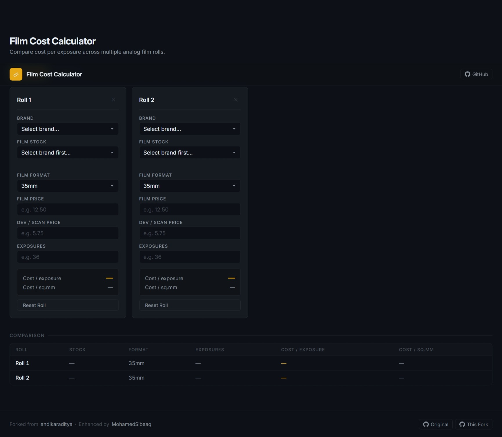

# film-calculator

> **Fork** of [andikaraditya/film-calculator](https://github.com/andikaraditya/film-calculator) — modernised UI, dynamic `config.yaml` data loading, film brand/stock picker, and side-by-side roll comparison.

Calculate the **cost per exposure** and **cost per square millimetre** for analog film rolls. Compare multiple rolls to find the best value.

[**Open Calculator**](https://MohamedSibaaq.github.io/film-calculator/)

## Features

- **Dynamic config** — film formats, brands, and stocks all come from `config.yaml`; no JS edits needed to add a new stock
- **Film stock picker** — browse Kodak, Fujifilm, Ilford, Lomography, CineStill and more; each stock shows ISO and type (Color / B&W / Slide)
- **Comparison table** — side-by-side cost breakdown across all rolls, with the cheapest highlighted automatically
- **Drag-to-reorder** — rearrange rolls by dragging
- **Auto-save** — data persists in `localStorage` across page reloads
- Up to 10 simultaneous rolls
- Fully responsive (mobile-friendly)

## Configuration

All primary data lives in [`config.yaml`](config.yaml).

| Section | Purpose |
|---|---|
| `site` | Page title, author credits, repository URLs |
| `app` | `max_rolls`, `default_rolls` on first load |
| `film_formats` | Format label, selector value, and exposure area in sq. mm |
| `film_brands` | Brands with their film stocks (name, ISO, type) |

### Adding a film stock

```yaml
film_brands:
  - brand: "My Brand"
    films:
      - { name: "My Film 400", iso: 400, type: color }
```

Valid types: `color`, `bw`, `slide`

### Adding a film format

```yaml
film_formats:
  - { label: "6x17 Panoramic", value: "617", area_sqmm: 10200 }
```

## Running locally

```bash
docker compose up --build
```

Open `http://localhost` — nginx proxies to Flask on the internal network; port 5000 is never exposed to the host.

Edit `config.yaml` and refresh; the volume mount means no rebuild is needed.

## Cloud deployment

### 1 — Copy files to your server

```bash
rsync -av --exclude='.git' ./ user@<ip-address>:/opt/film-calculator/
```

### 2 — Open firewall ports

```bash
# ufw (Ubuntu/Debian)
sudo ufw allow 80/tcp
sudo ufw allow 443/tcp
```

### 3 — Deploy

```bash
ssh user@<ip-address>
cd /opt/film-calculator
docker compose up -d --build
```

The app is now live at `https://filmcalculator.tahlil.solutions/`.

---

### 4 — Add a domain + HTTPS (Let's Encrypt)

**Get a certificate** (run once on the host — stop nginx first so port 80 is free):

```bash
docker compose stop nginx
sudo apt install certbot          # or: snap install --classic certbot
sudo certbot certonly --standalone -d 'your-website-url'
docker compose start nginx
```

Certbot writes certs to `/etc/letsencrypt/live/your-website-url/`.

**Wire the certs into nginx:**

Create `nginx/certs/` and symlink (or copy) the files:

```bash
mkdir -p nginx/certs
sudo ln -sf /etc/letsencrypt/live/your-website-url/fullchain.pem  nginx/certs/fullchain.pem
sudo ln -sf /etc/letsencrypt/live/your-website-url/privkey.pem    nginx/certs/privkey.pem
```

**Edit [`nginx/nginx.conf`](nginx/nginx.conf):**

1. In the `server` block on port 80, replace the two `location` blocks with:
   ```nginx
   return 301 https://$host$request_uri;
   ```
2. Uncomment the entire `# ── HTTPS ──` server block — `${DOMAIN}` is already set; it will be substituted from `.env` at startup

**Uncomment the certs volume** in [`docker-compose.yml`](docker-compose.yml):
```yaml
      - ./nginx/certs:/etc/nginx/certs:ro
```

**Redeploy:**
```bash
docker compose up -d --force-recreate nginx
```

**Auto-renew** (add to root crontab):
```
0 3 * * * certbot renew --quiet && docker compose -f /opt/film-calculator/docker-compose.yml restart nginx
```

## Roadmap

- Integrate an exchange-rate API to fetch and cache up-to-date conversion rates.
- Auto-detect user geography and set a sensible default display currency.
- Add manual currency controls so users can change currency at any time.
- Let users set and persist a preferred primary currency across sessions.
- Show roll totals and comparison values converted into the preferred currency.

## Demo




## Credits

Original project created by [**andikaraditya**](https://github.com/andikaraditya) — [andikaraditya/film-calculator](https://github.com/andikaraditya/film-calculator)

This fork maintained by [**MohamedSibaaq**](https://github.com/MohamedSibaaq).

## License

[MIT](LICENSE)
